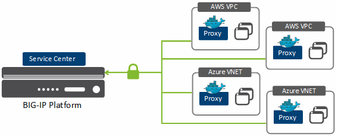

Lab Overview
===================================================

The below diagram shows the network design and components used in this guide. 

   |components|

+----------------------+--------------+-------------+
| Network              | Subnet CDR   | Subnet Type |
+======================+==============+=============+
| 1. mgmt  | 10.1.0.16/28  | Internal      |
+----------------------+--------------+-------------+
| 2. external | 10.1.0.16/28 | Internal      |
+----------------------+--------------+-------------+

