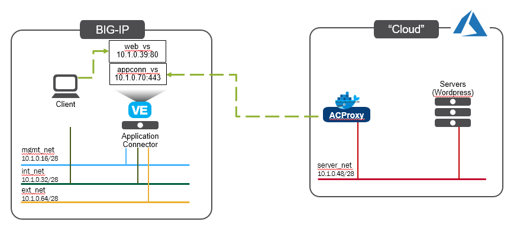

Lab Overview
===================================================

The below diagram shows the network design and components used in this guide. 
Configure your 

   |components|

+---------------+--------------+-------------+
| Network       | Subnet CDR   | Subnet Type |
+---------------+--------------+-------------+
| 1. mgmt_net   | 10.1.0.16/28 | Internal    |
+---------------+--------------+-------------+
| 2. int_net    | 10.1.0.32/28 | Internal    |
+---------------+--------------+-------------+
| 3. server_net | 10.1.0.48/28 | Internal    |
+---------------+--------------+-------------+
| 4. ext_net    | 10.1.0.64/28 | Internal    |
+---------------+--------------+-------------+

