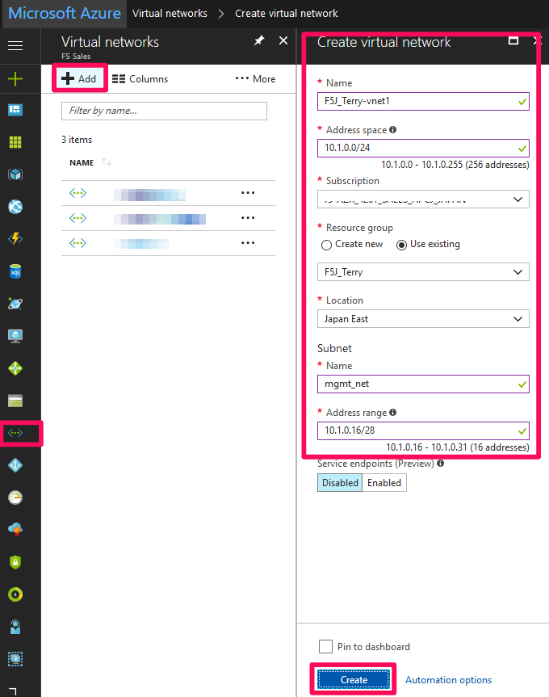

Create Required Virtual Networks (Vnet), Subnets, and Network Security Group (NSG)
=============================

The vnets and subnets created here will be used for connectivity between all components.

#. In the hub menu, select the **Vnet** icon and create a Vnet.

|task-1-1|

#. After creating the Vnet, add three more subnets for 
    internal, external, and server networks like below.  

|task-1-2|

|task-1-3|

|task-1-4|

|task-1-5|

#. In the hub menu, search for NSG to create the Network Security Group to configure
    external management access to your Azure instances. NSG's provide isolation and protection
    of network traffic in your cloud environment. 

|task-1-6|

|task-1-7|

#. Modify your NSG to allow traffic to ports 443, 22, 5091 (VNC), etc. to your instances
    as necessary.

|task-1-8|

.. |task-1-5| image:: images/task-1-5.png

