Configuring the Service Center on the BIG-IP System
=============================

To configure the F5® Application Connector Service Center on a BIG-IP® system,
complete the following tasks.

In this guide, we will use the below Azure ARM template to deploy a BIG-IP HA pair
using the existing network stack created earlier. 

https://github.com/F5Networks/f5-azure-arm-templates/tree/master/supported/ha-avset/existing_stack

#. Click one of the deploy buttons depending on your preferred license type. 
   In this guide we will use the BYOL deploy button and evaluation licenses. 

.. NOTE::
   Use the information gathered in the previous step to fill in the tenant id, client id, and 
   service principle secret.

.. NOTE::
   The first three addresses in the subnet are reserved for Azure service usage.

  |task-1-1|

  |task-1-2|

  |task-1-3|

#. Enter in the required configurations, agree to terms and conditions then click **Purchase**.

   |task-1-4|

#. Confirm BIG-IP HA configuration. 

  |task-1-5|

#. Provision iRules LX on both BIG-IP units.

  |task-1-6|

#. Enable iApps LX on both BIG-IP units via CLI.

``touch /var/config/rest/iapps/enable``

.. NOTE::
   You may need to refresh the UI to see the iApps LX menus. 

  |task-1-7|

#. Download and import the F5_Application_Connector_Service_Center package 

  |task-1-8|

#. Deploy the Service Center.

  |task-1-9|

  |task-1-10|

  |task-1-11|

  |task-1-12|

  |task-1-13|

  |task-1-14|

  |task-1-15|

  |task-1-16|

This completes the configuration of Service Center.

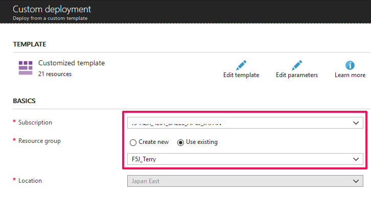
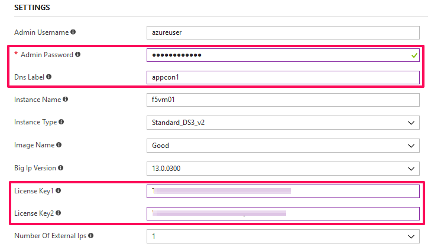
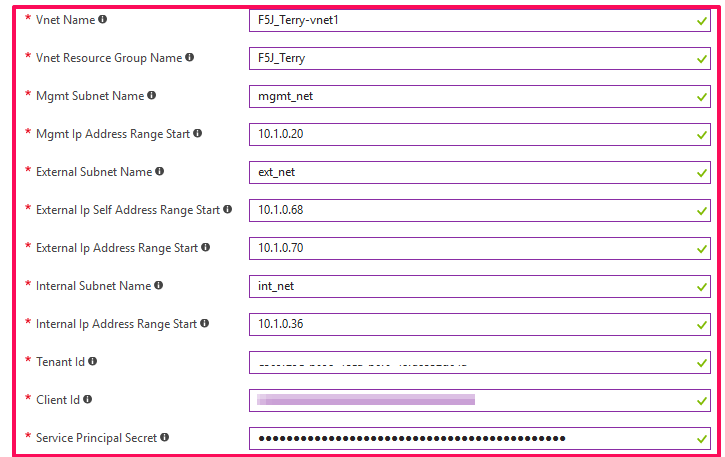
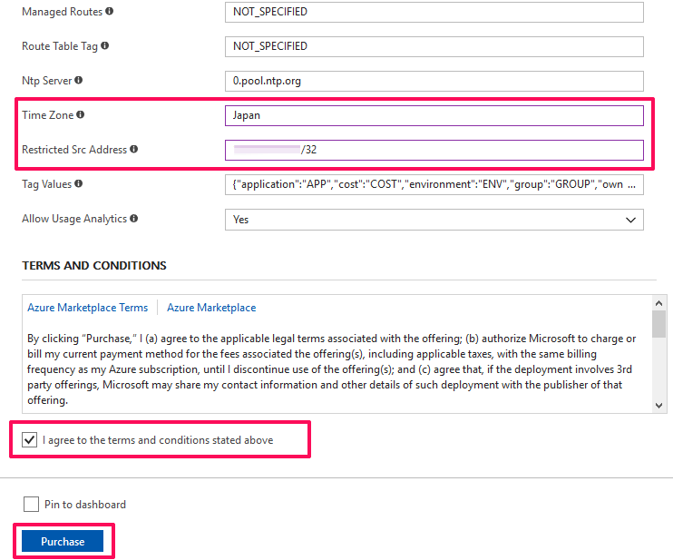
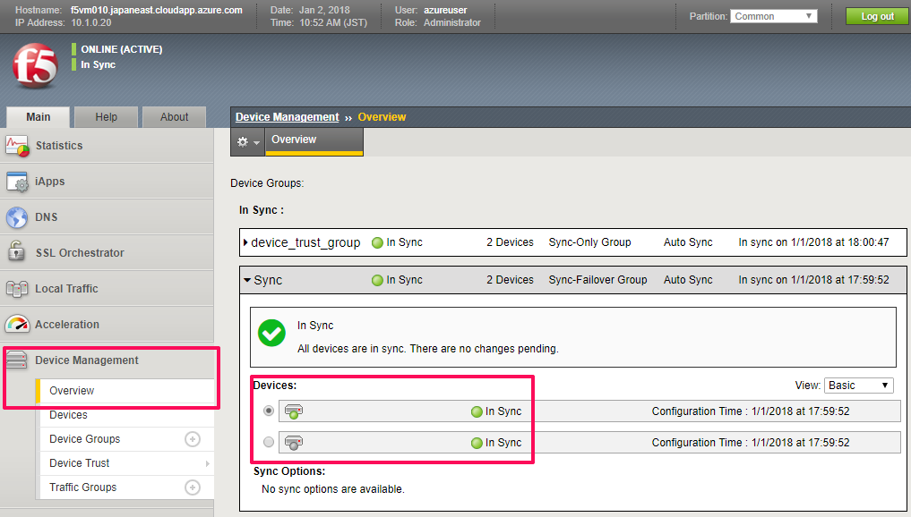
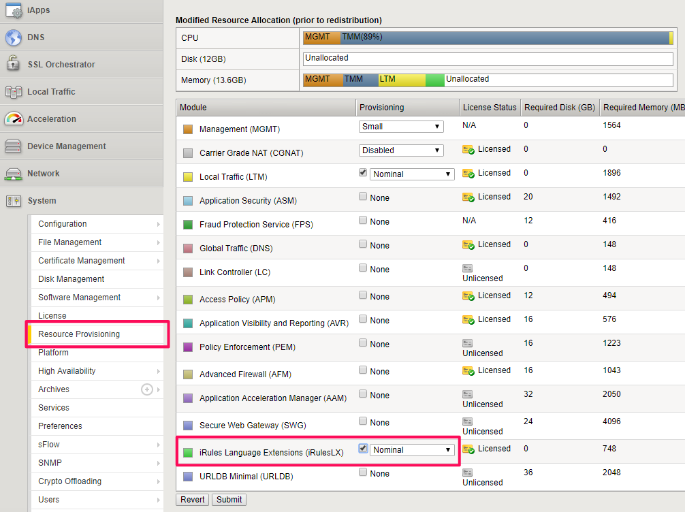
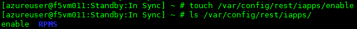
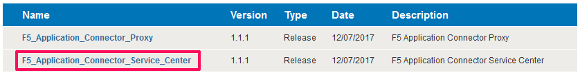
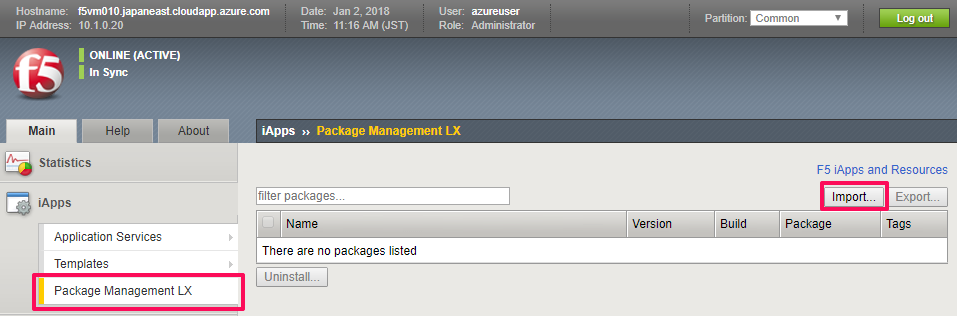
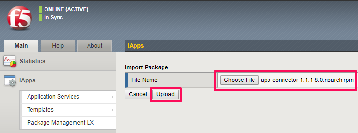
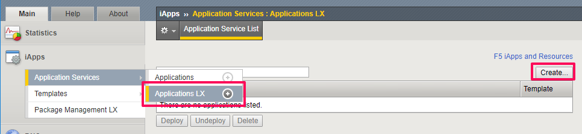
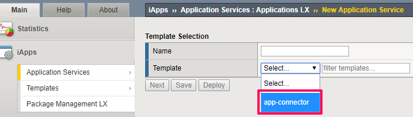
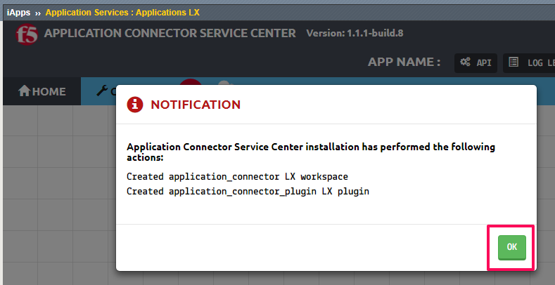
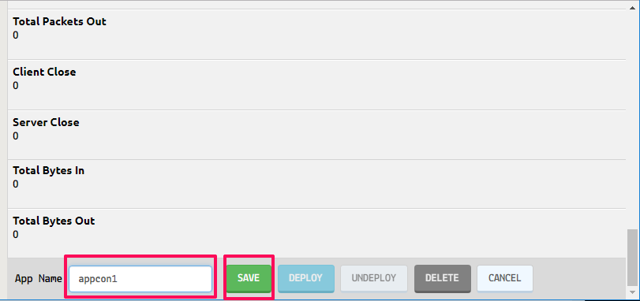
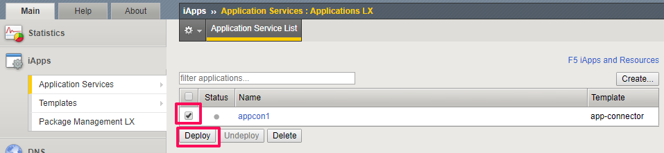
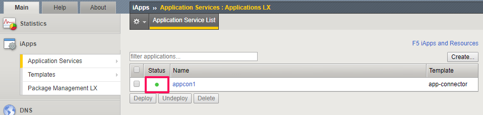