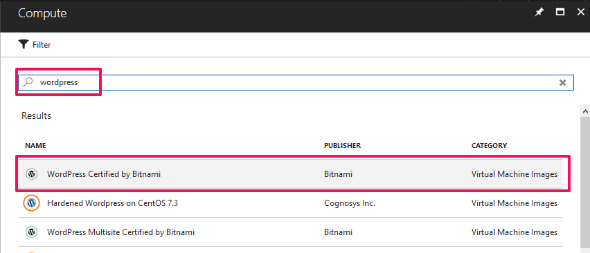
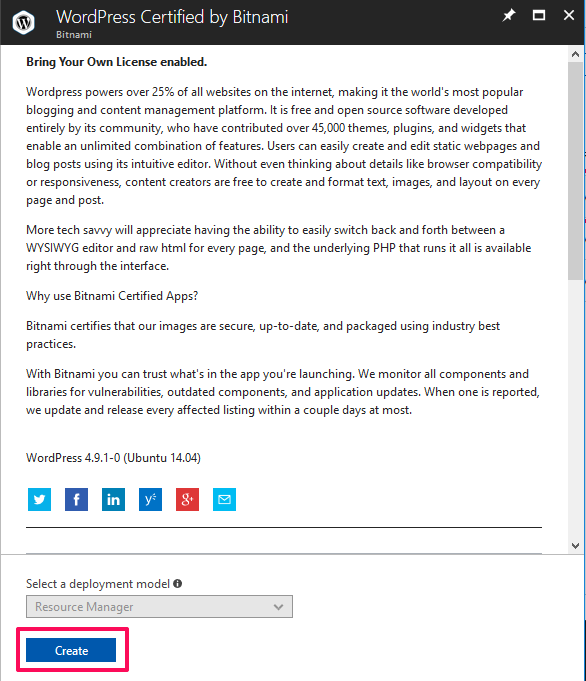
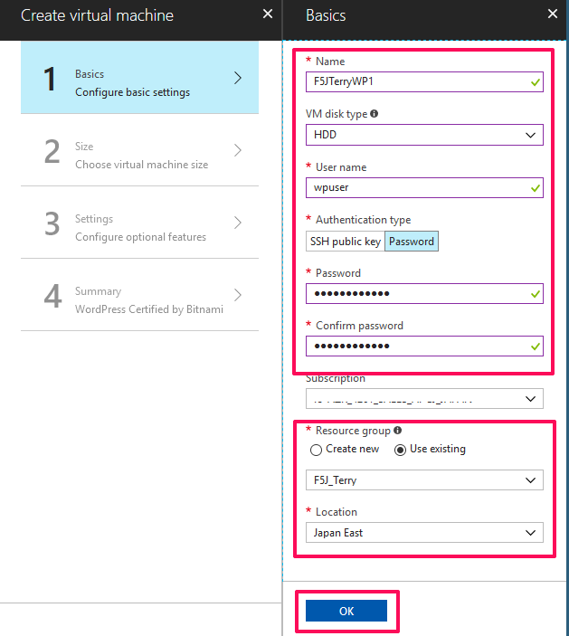
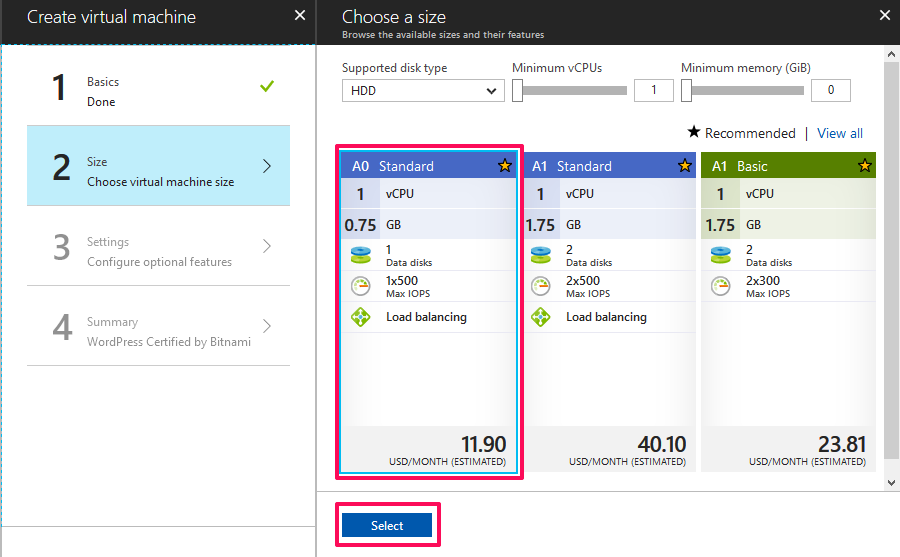
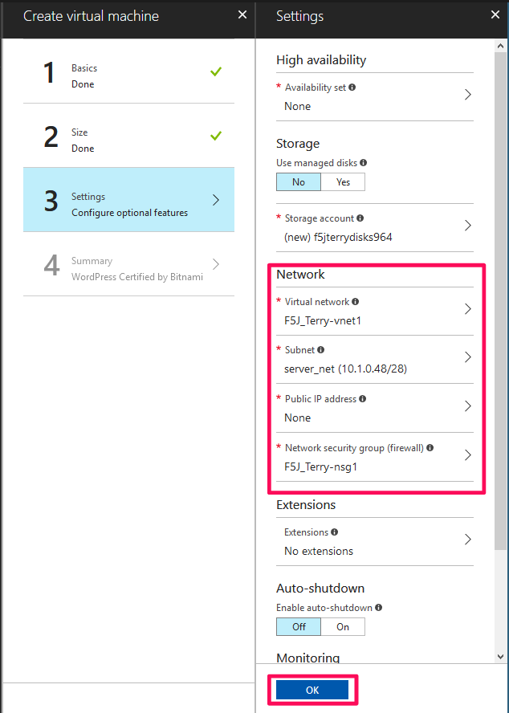
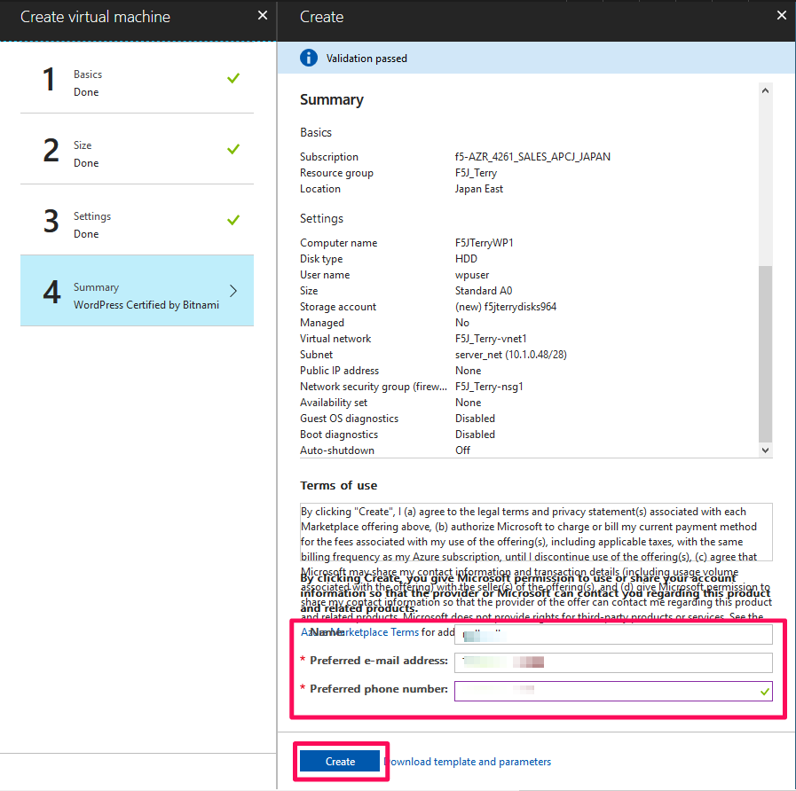

Configuring the Backend WordPress Server in Azure
=============================

To configure a WordPress instance in Azure, complete the following tasks.

#. Deploy a WordPress instance from the the Azure Marketplace like below. 

|task-1-1|

|task-1-2|

|task-1-3|

|task-1-4|

|task-1-5|

|task-1-6|

