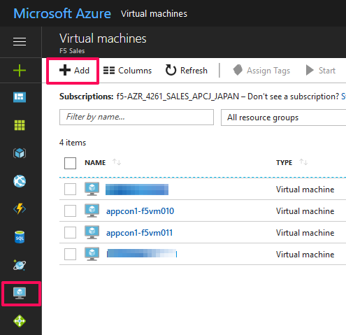
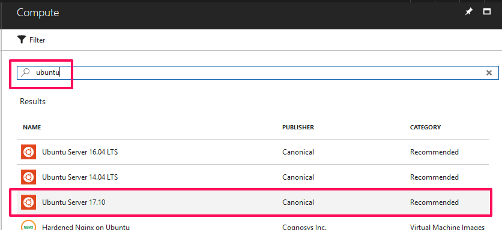
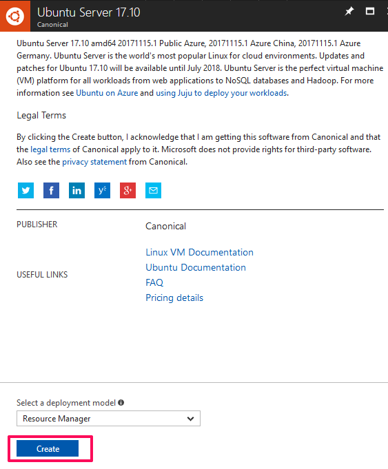
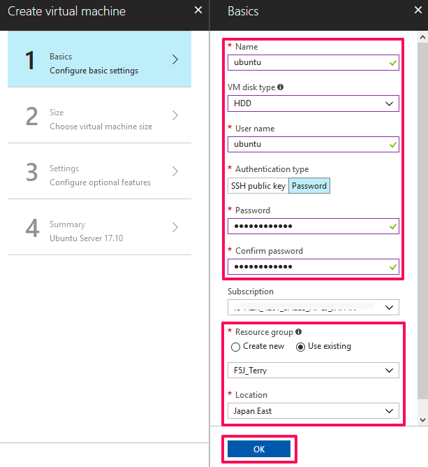
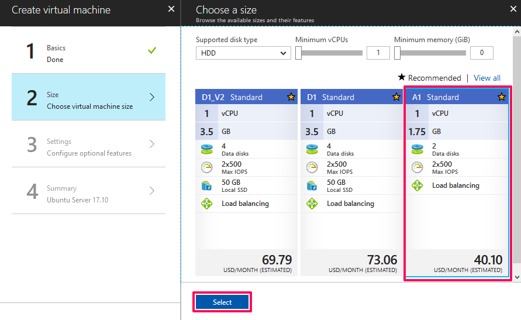
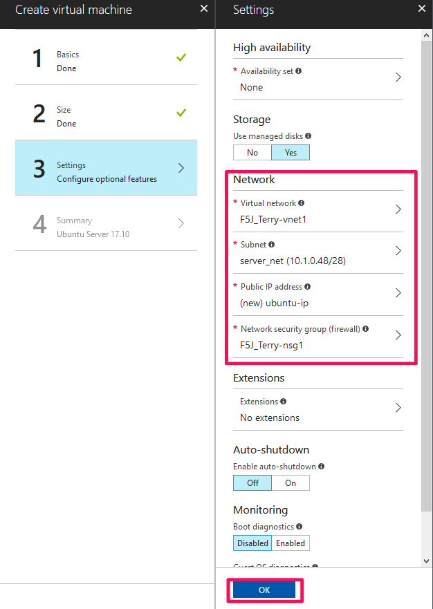
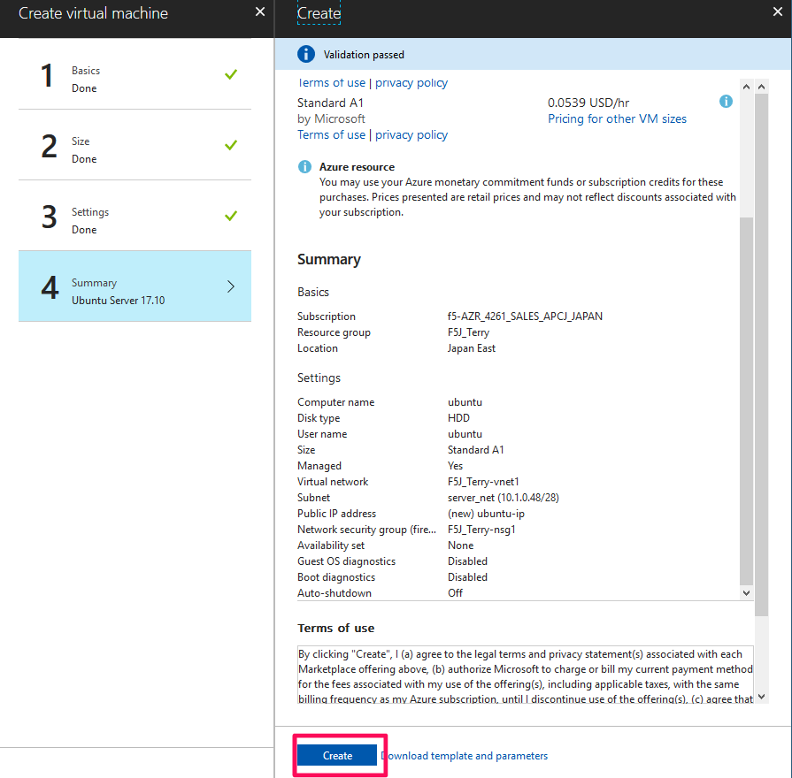

Configuring the Linux instance for the Application Connector Proxy in Azure
=============================

To configure an Ubuntu Linux instance with Docker, complete the following tasks.

#. Deploy an Ubuntu instance from the the Azure Marketplace like below. 

     |task-1-1|

     |task-1-2|

     |task-1-3|
 
     |task-1-4|

     |task-1-5|

     |task-1-6|
 
     |task-1-7|

#. Follow instructions below to install Docker. 

https://docs.docker.com/engine/installation/linux/docker-ce/ubuntu/

