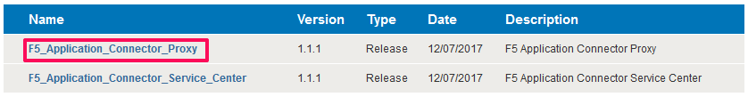
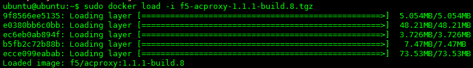
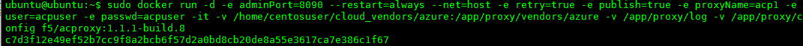
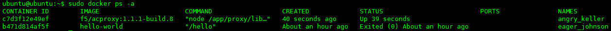

Configuring the Application Connector Proxy in Azure
=============================

To configure the F5® Application Connector Proxy, complete the following tasks.

#. Download the f5-acproxy-1.1.1-build.8.tgz package.

   |task-2-1|

#. Use SCP to copy the package to the below directory of the Linux instance.

   ``/home/<user>``

#. Create the ``/home/<user>/cloud_vendors/azure`` which will contain the 
   below file used for the auto discovery feature in Azure.

   For example, enter below command from the user prompt: 
   ``mkdir -p cloud_vendors/azure``

#. Create the azure_config.json file that contains the Azure credentials gathered earlier. 

{    
          "TENANT":"your tenant ID",
          "AZURE_SUBSCRIPTION_ID":"your azure subscription ID",
          "CLIENT_ID":"client or application ID",
          "APPLICATION_SECRET":"client or application secret"
          }

#. Install the Application Connector Proxy Docker image.

  ``sudo docker load -i <file-name>.tar.gz``

   |task-2-2|

#. Start the Docker container. This example launches a 
    Proxy with the user interface accessible on port 8090.

   ``sudo docker run -d -e adminPort=8090 --restart=always --net=host -e retry=true -e publish=true -e proxyName=<proxy-name> -e user=<user-name> -e passwd=<password> -it -v /home/<user-dir>/cloud_vendors/<vendor-name>:/app/proxy/vendors/<vendor-name> -v /app/proxy/log -v /app/proxy/config f5/acproxy:x.x.x-build.xx``

   ie. 

   ``sudo docker run -d -e adminPort=8090 --restart=always --net=host -e retry=true -e publish=true -e proxyName=acp1 -e user=acpuser -e passwd=acpuser -it -v /home/ubuntu/cloud_vendors/azure:/app/proxy/vendors/azure -v /app/proxy/log -v /app/proxy/config f5/acproxy:1.1.1-build.8``
 
   |task-2-3|

#. Confirm the Docker container is running

  ``sudo docker ps -a``

   |task-2-4|

