Create Virtual Server for Proxy Traffic on BIG-IP
=============================

The BIG-IP® system needs a virtual server that the Proxy can connect to.

#. Create a Virtual Server like below.

     .. NOTE::
         The Virtual Server IP would normally be a public IP that would float to the standby upon 
         failover. By default, Azure does not support this functionality so we will use a static IP 
         configured as a secondary IP on BIG-IP network interface.

     |task-3-1|

     |task-3-2|

     |task-3-3|

#. Add the IP as a secondary IP in the external network interface.

     |task-3-4|

#. Add the Virtual Server in the Service Center like below.

     |task-3-5|

     |task-3-6|

     |task-3-7|

     |task-3-8|

#. Add the Virtual Server in the Proxy GUI like below.

        .. NOTE::
             Ensure that you have network access to the Docker image port you specified in the "docker run" 
             command. For instance, port *8090*.

     |task-3-9|

     |task-3-10|

#. Authorize the Proxy from the Service Center like below.

     |task-3-11|

     |task-3-12|

#. Confirm in the Proxy that the connection is green and established.

     |task-3-13|

#. Also note that the Node Discovery status is **Authenticated**.
    If it is not authenticated, check your azure_config.json file on the host.

     |task-3-14|

Application Connector is now configured for node auto discovery in Azure.

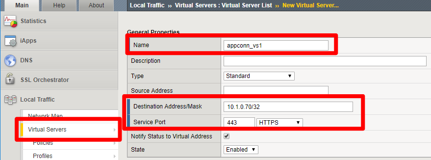
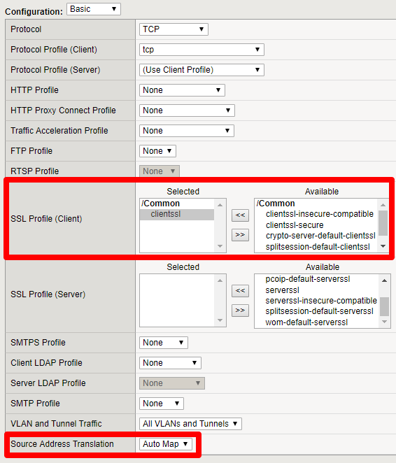
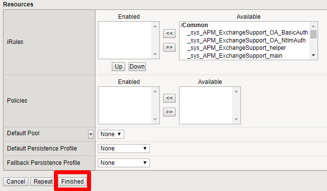
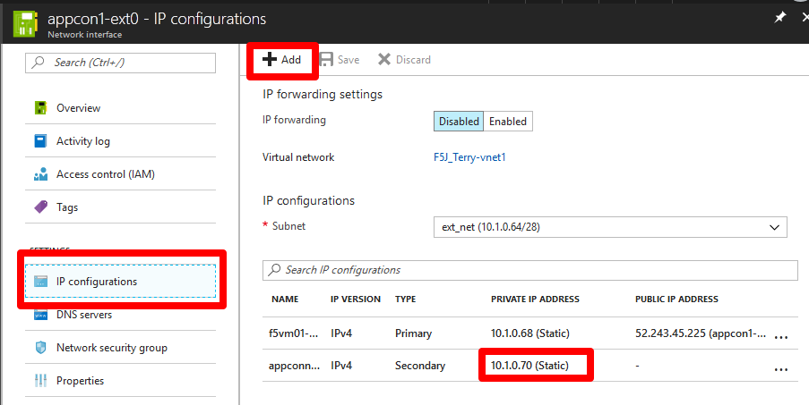
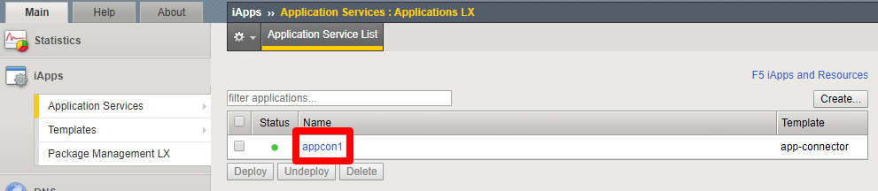
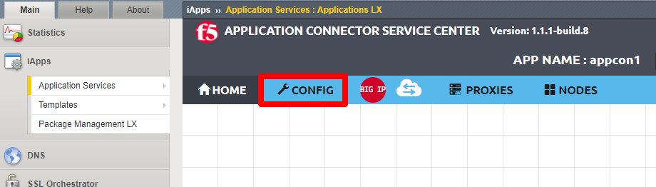
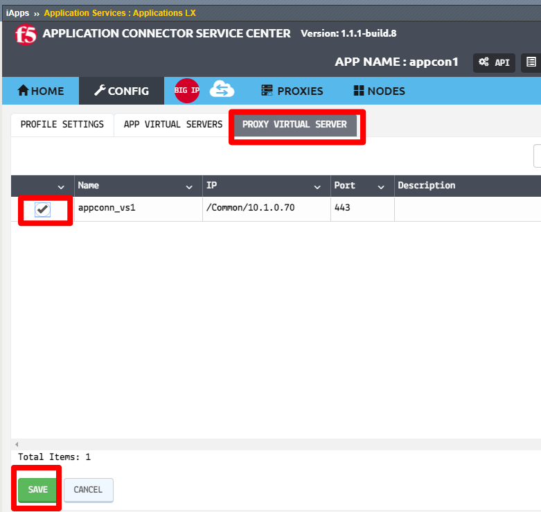
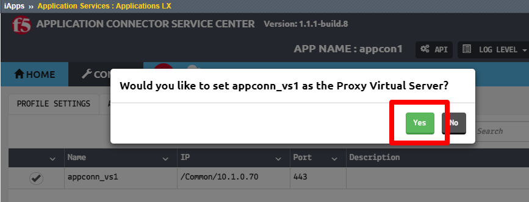
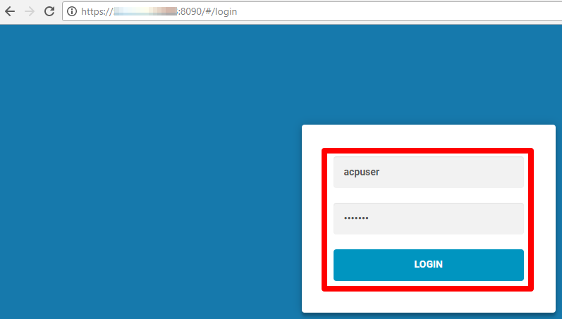
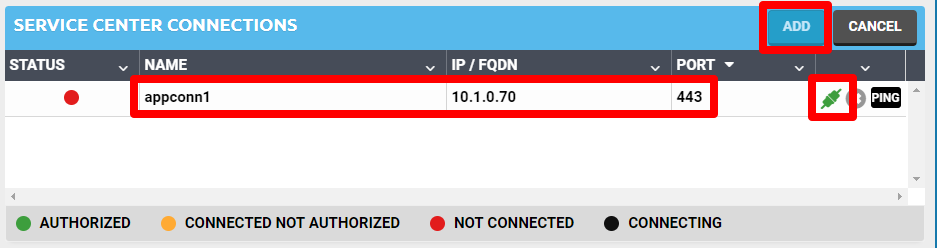

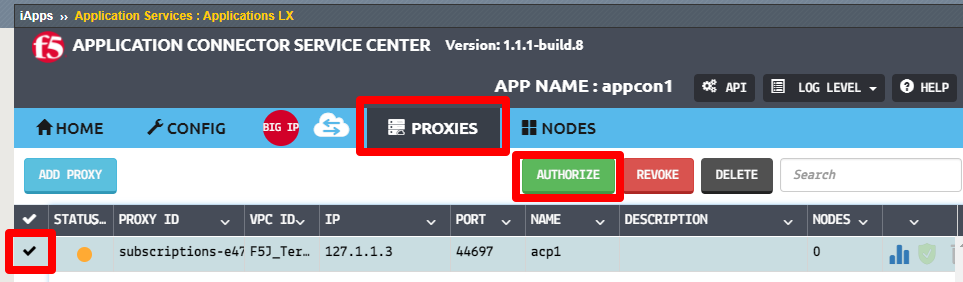
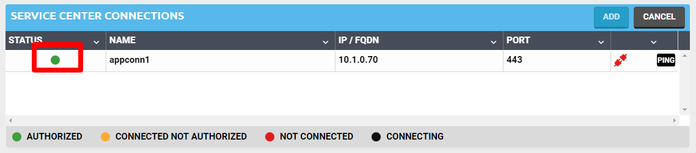
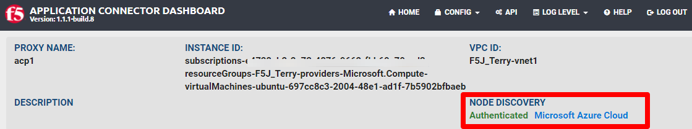