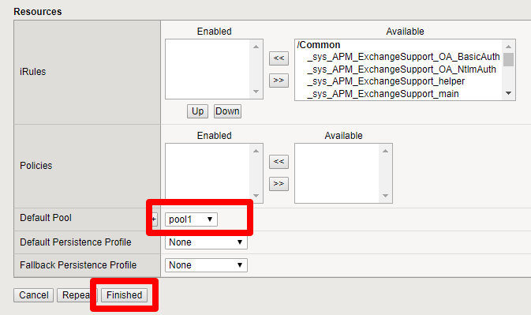
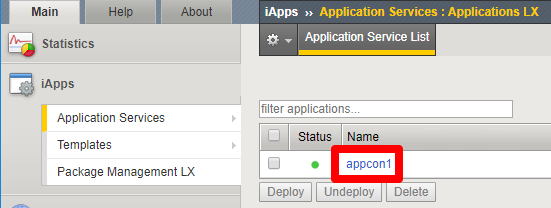

Add Virtual Server for application access
=============================

#. Create a pool that contains the WordPress server created earlier.

|task-1-1|

#. Create a virtual server with an IP in the internal subnet. 
    This virtual server will process application traffic. Add the pool you just created.

|task-1-2|

|task-1-3|

|task-1-4|

#. Configure this virtual server IP as a secondary IP on the 
    internal network interface in Azure.

|task-1-5|

#. Add the virtual server you just created in the Service Center.

|task-1-6|

|task-1-7|

|task-1-8|

#. Note the iRule that was applied to the virtual server. 

|task-1-9|

.. code-block:: tcl
    # This iRule determines if a flow is directed to a public cloud server
    # or a private cloud server.  If going public it fowards to Nodejs
    # process which is listenting for new TCP connections which then
    # forwards the flow to the public cloud

    when LB_SELECTED {
        set server_addr [LB::server addr]
        set server_port [LB::server port]
        set server_pool [LB::server pool]

        set RPC_HANDLE [ILX::init application_connector_plugin application_connector_ext]
        if { [catch { set port [ILX::call $RPC_HANDLE findCloudServer $server_addr $server_port $server_pool] } ] } {
          # iRule timed out (dropping flow)
          reject
          return
        }

        if {$port ne -1} {
          # forward to the proxy
          LB::reselect node 127.0.0.1 $port
          event disable
        }
          # forward to local servers
    }

.. |task-1-3| image:: images/task-1-3.png

