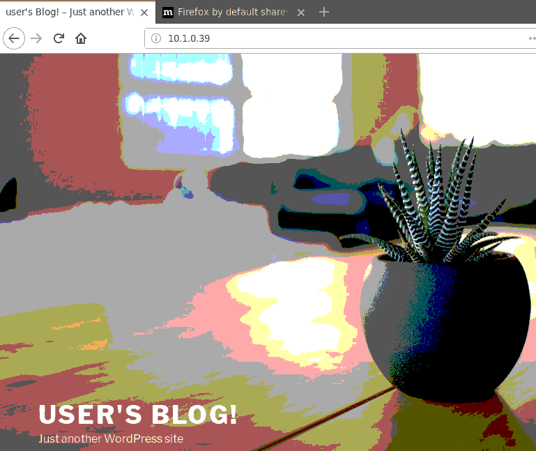

Test Access to Application from Client Instance
=============================

#. From the Azure marketplace, deploy any client instance 
    in the internal subnet and login via VNC or RDP.

#. Try to access the virtual server you previously created.
    The page displayed will be the WordPress server deployed earlier.

|task-2-1|

